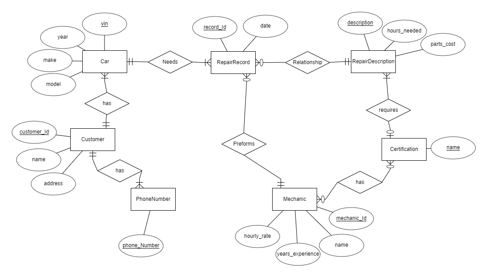
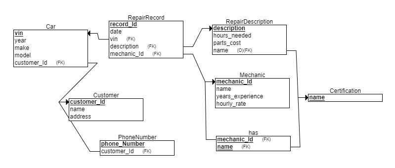

DataBase Capstone

## Entity Relationship
The entities in this project are a *Car*, a *Customer*, *Phone Number*, *Mechanic*, *Certification*, *RepairDescription*, and *RepairRecord*. 

A Car is identified by the *vin*.
A Customer is identified by a *customer id*.
A Phone Number is identified by the *phone number*.
A Mechanic is identified by the *mechanic id*.
A Certification is idsentified by the *name*.
A RepairDescription is identified by the *description*.
A RepairRecord is identified by the *record id*.

A Customer has at least one car and at least one phone number. A RepairRecord needs to be associated with a mechanic, RepairDescription, and Car. A car needs to be associated with a customer. A ReapirDescription can be associated with a certification, but it does not have to. A certification is also optional for a mechanic.

## Relational
The diagram below shows the entity-relationship diagram converted to a relational schema.

The corresponding sql can be found [here](sql/install.sql).

## Build/Install/Run

### Docker Playground

Go to the [Docker Playground](http://play-with-docker.com) and confirm that you are not a robot.  
In the left-hand menu, click on "ADD NEW INSTANCE"  
This will start a Docker instance (node) and log you in as the root user. 
Execute the following command:

`curl --request GET --header 'PRIVATE-TOKEN: Egn_hgcEpyWpCh5-doBa' -o runme.sh 'https://code.vt.edu/api/v4/projects/4010/repository/files/runme%2Esh/raw?ref=master' && bash ./runme.sh`

This will start up a container listening on port 8080. Notice at the top of the page next to the
node's IP address there is now a link labeled **8080**. Click on that link to use the application.

## Using the app

### Cusomers

On the customers page the user can see all customers. Customers can be edited by selection the pencil icon in the row and created by selecting the *Add new record* button on the top right of the table. Customers cannot be deleted.

By selecting the phone icon in the row, the user can list all phone numbers associated with the customer. They can also create phone numbers for the customer by selecting the *Add new record* button. Phone number can be deleted by clicking on the trash can icon in the row. Phone number cannot be edited. Every Phone number must be a unique number.

### Cars

On the cars page the user can see all cars. Cars can be edited by selection the pencil icon in the row, created by selecting the *Add new record* button on the top right of the table, and deleted by selecting the trash can icon.

### Certifications

On the certifications page the user can see all certifications. Certifications can be created and deleted, but not edited.

### Mechanics

On the mechanic page the user can see all mechanics. Mechanics can be created, edited, and deleted. Horule wages are calculated automatically based on the mechanics experience and number of certifications. The base pay is $13.00 and a mechanic gets a $0.50 raise for every year of experience and a $1.00 raise for every certification.

By selecting the list icons in the rows, the user can see all certifications teh mechanic has. The user can add a certification to the mechanic by selecting the *Add new record* button and remove a certification to the user by clicking the trash can icon.

### Repair Description and Estimates

On this page the user can list, create, edit, and delete RepaorDescriptions.

The user can also select descriptions and get an estimate for each repair and a total cost estimate. A mechanic is selected by mechanics who have the required certifications, then the mechanic with the lowest work load, and then the mechanic with the highest hourly wage. The user can select the VIN of the cars that the repairs are being done on and then create RepairRecords by selecting the *Add Repairs* button.

### Repair Record

On this page the user can create, edit, and delete RepairRecords.

